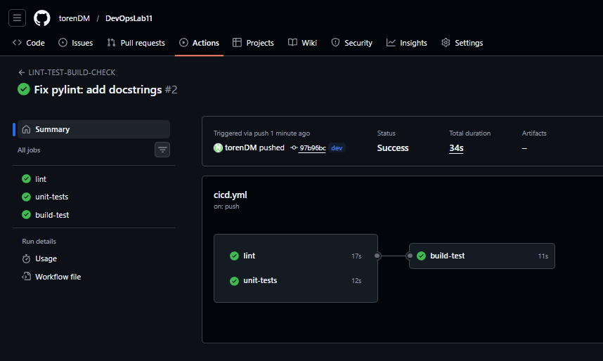
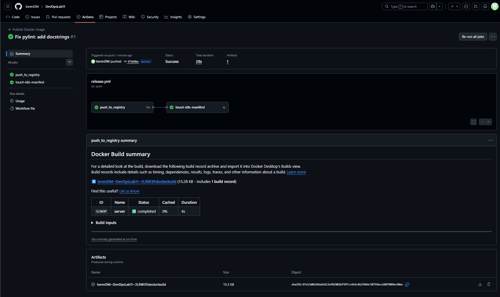
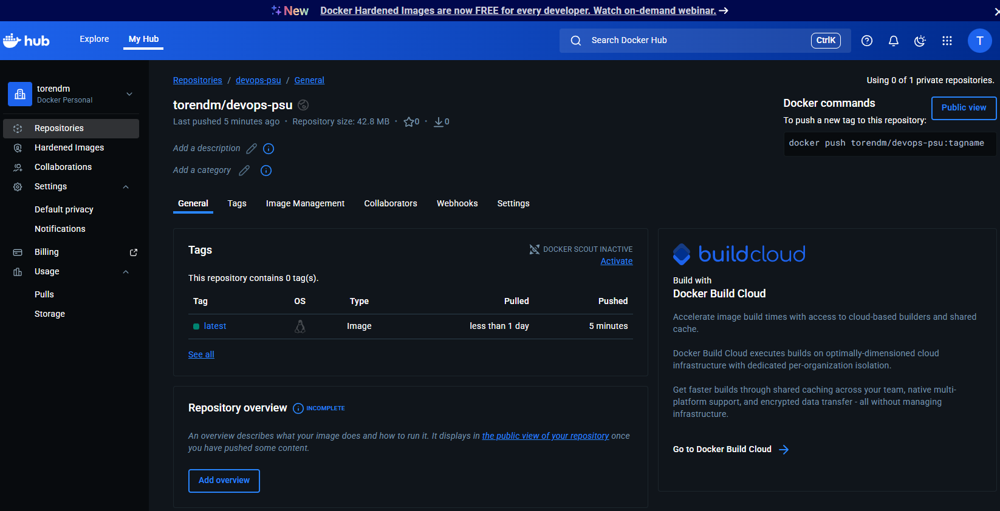
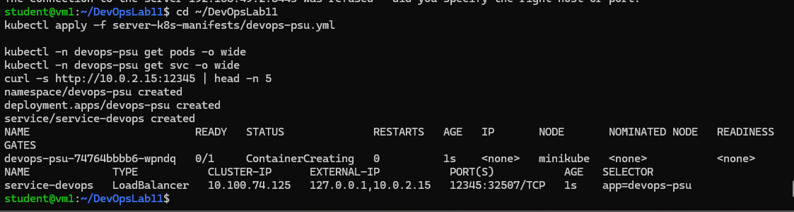
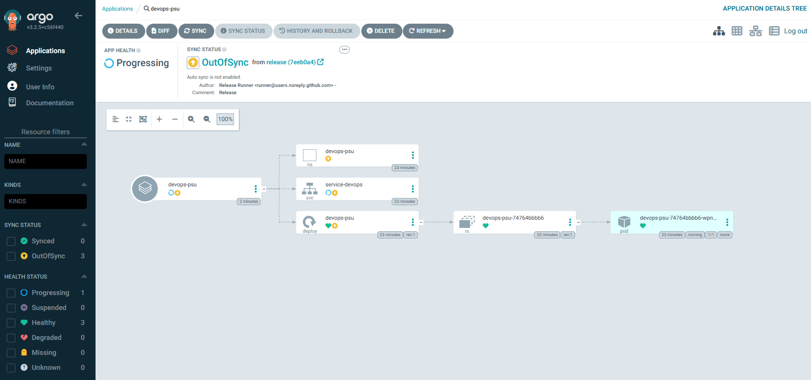
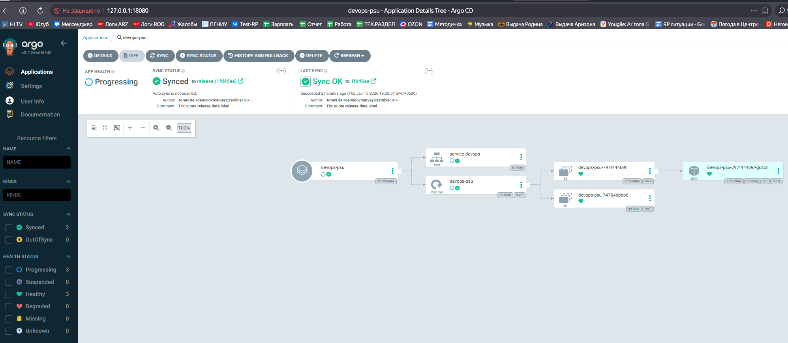

# DevOps Lab 11 — CI/CD (GitHub Actions → DockerHub → ArgoCD)

**Демидов Матвей Александрович, ФИТ-1-2024 НМ**  
**Дисциплина:** Методы и инструменты DevOps  
**Лабораторная работа:** ЛР 11

---

## 1) Цель работы
Настроить полный CI/CD-пайплайн:
- CI в GitHub Actions: линтинг + unit-тесты + сборка/проверка Docker-образа;
- CD в GitHub Actions: сборка и публикация Docker-образа в DockerHub, обновление манифестов в ветку `release`;
- GitOps-развёртывание через ArgoCD из ветки `release` в Kubernetes (minikube).

---

## 2) Стенд
- Host OS: Windows 11  
- VirtualBox: 7.2.4  
- VM1: Ubuntu Server 24.04.3, IP: **10.0.2.15**  
- NAT network: `nat-devops`  
- Доступ к VM1: `ssh student@127.0.0.1 -p 2222`

---

## 3) Репозиторий и структура
GitHub repo: `https://github.com/torenDM/DevOpsLab11`

```
DevOpsLab11/
  server/
    application.py
    test_application.py
    requirements.txt
    dockerfile
    __init__.py
  server-k8s-manifests/
    devops-psu.yml
  .github/workflows/
    cicd.yml
    release.yml
  screens/
    01_actions_ci_green.png
    02_actions_release_green.png
    03_dockerhub_latest_tag.png
    04_k8s_pods_svc.png
    05_argocd_app_created.png
    06_argocd_synced_healthy.png
  README.md
```

---

## 4) Часть A — приложение и Docker
### 4.1 Python-приложение
Файл: `server/application.py` — простой HTTP server (порт 8000), а также класс `TestMe` для unit-тестов.

### 4.2 Unit-тесты
Файл: `server/test_application.py`, запуск:
```bash
pytest -q
```

### 4.3 Dockerfile
Файл: `server/dockerfile`  
Образ публикуется как:
- `torendm/devops-psu:latest`

---

## 5) Часть B — Kubernetes манифест
Файл: `server-k8s-manifests/devops-psu.yml`

Содержит:
- Deployment (namespace `devops-psu`)
- Service `service-devops` типа LoadBalancer
- внешний порт: **12345** → containerPort **8000**
- `externalIPs: 10.0.2.15`

Примечание: значение label `release-date` должно быть строкой (в кавычках).

---

## 6) GitHub Actions (CI/CD)

### 6.1 CI (ветка `dev`)
Workflow: `.github/workflows/cicd.yml`
- pylint
- pytest
- docker build/run + curl check

### 6.2 CD (ветка `master`)
Workflow: `.github/workflows/release.yml`
- login в DockerHub через secrets
- build & push образа `torendm/devops-psu:latest`
- обновление `release-date` и push в ветку `release`

Secrets в GitHub:
- `DOCKER_USERNAME`
- `DOCKER_TOKEN`

---

## 7) ArgoCD (GitOps)
- ArgoCD установлен в namespace `argocd`
- Создано приложение `devops-psu`
- Source: repo DevOpsLab11, revision: `release`, path: `server-k8s-manifests`
- Destination namespace: `devops-psu`
- Синхронизация выполнена вручную (Manual Sync)

---

## 8) Скриншоты (screens/)
### CI/CD
1. CI workflow зелёный (ветка dev)  


2. Release workflow зелёный (ветка master)  


3. DockerHub: тег `latest` у `torendm/devops-psu`  


### Kubernetes и ArgoCD
4. `kubectl get pods/svc` в namespace `devops-psu`  


5. ArgoCD: приложение создано (revision `release`)  


6. ArgoCD: статус **Synced** и **Healthy**  

